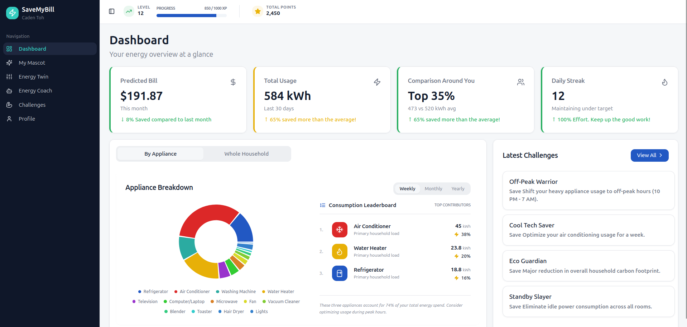
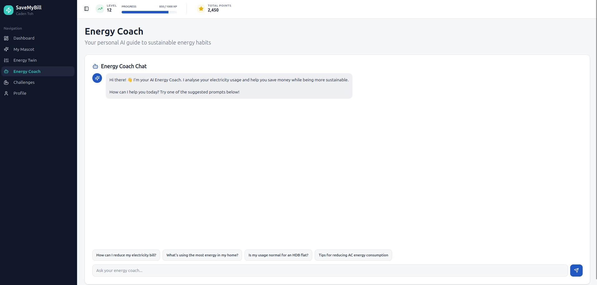
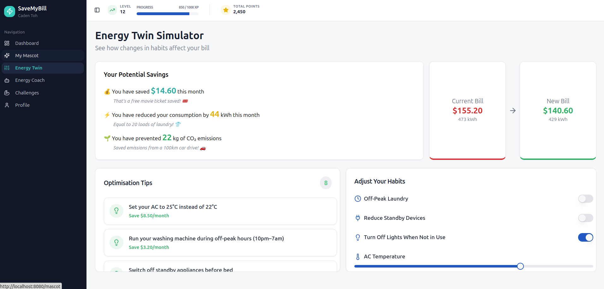
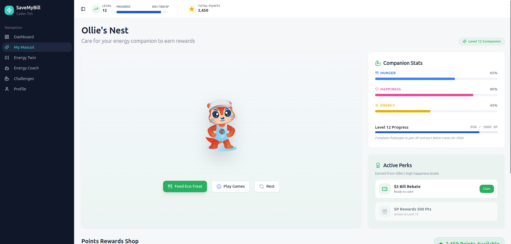
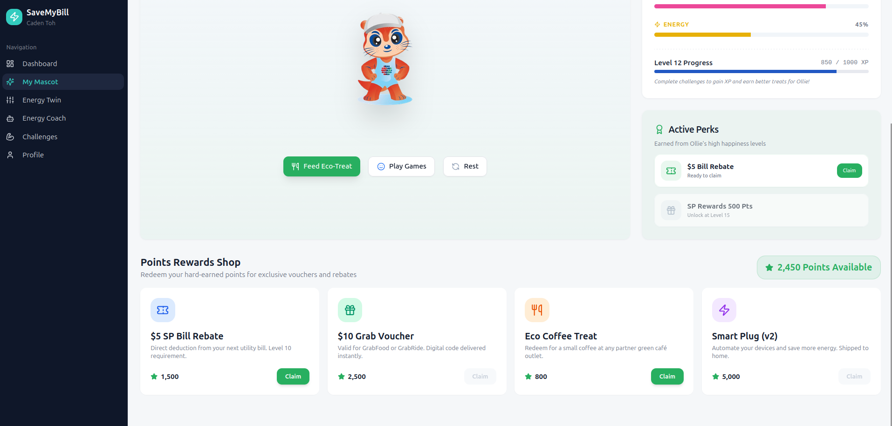
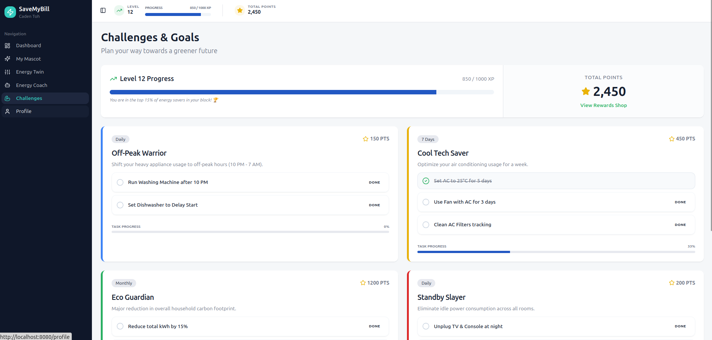

# ⚡ SaveMyBill

## Project Overview

**SaveMyBill** is an intelligent energy management platform designed to help users monitor, simulate, and gamify their energy consumption. By combining real-time data visualization with AI-driven insights and a gamified experience, we empower households to reduce their carbon footprint while saving money.

## 🚀 Key Features

### 📊 Intelligent Dashboard

Monitor your energy usage patterns in real-time with an intuitive, data-driven interface. The dashboard provides a comprehensive overview of your consumption trends, helping you identify savings opportunities at a glance.


### 🤖 AI Energy Coach

Your personal guide to sustainable living. The AI Energy Coach analyzes your usage and provides tailored recommendations to help you reduce your carbon footprint and save on energy costs.


### 🏗️ Digital Energy Twin

Visualize the future of your home's energy. The Digital Twin simulator allows you to model different scenarios, such as upgrading appliances or changing daily routines, to see the potential impact on your bills.


### 🐨 Interactive Mascot (Ollie)

Gamify your energy-saving journey with Ollie! Take care of your virtual mascot by completing energy-saving tasks. Level up Ollie to unlock exclusive vouchers and rebates while building better habits.

<div align="center">
  
  
</div>

### 🏆 Gamified Challenges

Turn energy conservation into a rewarding experience. Participate in diverse challenges, track your progress, and earn points to redeem for exciting rewards, making sustainability both fun and impactful.


## 🛠 Tech Stack

This project is built with:

- **Framework**: Vite, React, TypeScript
- **Styling**: Tailwind CSS, shadcn-ui
- **Icons**: Lucide React
- **Animations**: Framer Motion

## 📦 Installation

1. Clone the repository:

```bash
git clone git@github.com:StrongestCoderOfAllTime/hackomania-2026-frontend.git
```

2. Navigate into the repository:

```bash
cd hackomania-2026-frontend/
```

3. Install dependencies:

```bash
npm install
```

4. Run the development server:

```bash
npm run dev
```
